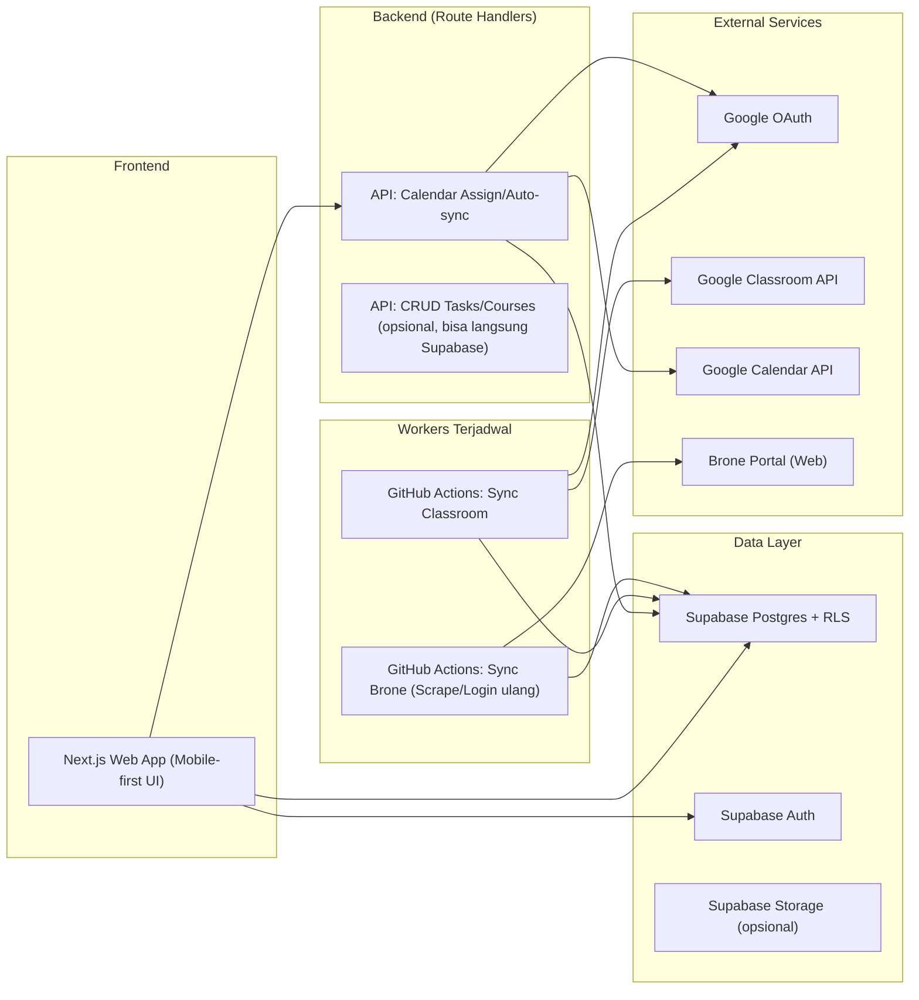
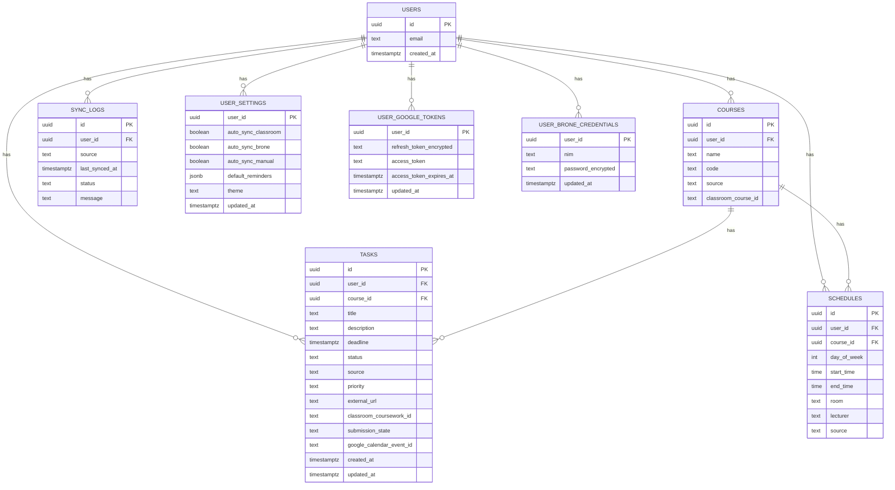

## 1. Desain Arsitektur



Prinsip utama:
- UI dan baca data dilakukan dari Supabase (cepat, sederhana, minim backend custom).
- Sinkronisasi berat (Classroom/Brone) dijalankan oleh GitHub Actions agar tetap gratis dan tidak terbentur limit serverless.
- Auto-sync Google Calendar dibuat idempotent untuk mencegah spam event.

## 2. Deskripsi Teknologi
- Frontend: Next.js (App Router) + TypeScript
- Styling: Tailwind CSS
- Auth & DB: Supabase (Auth + Postgres)
- Background jobs: GitHub Actions (schedule)
- Scraping Brone: Playwright atau Puppeteer (dipilih saat implementasi berdasarkan kebutuhan login/session)
- Integrasi Google:
  - OAuth untuk mendapatkan refresh token (Classroom + Calendar)
  - Google Classroom API untuk tugas + deadline + status submission
  - Google Calendar API (scope calendar.events) untuk event + reminders

## 3. Definisi Route
| Route | Tujuan |
|-------|--------|
| / | Redirect ke /dashboard atau /login |
| /login | Email login + tombol “Connect Google” |
| /dashboard | Ringkasan hari ini + upcoming + weekly view |
| /tasks | List semua tugas + filter/sort + tambah manual |
| /tasks/[id] | Detail tugas + status + info sumber |
| /schedule | Jadwal kuliah mingguan (base schedule Brone) |
| /courses | List mata kuliah + progress tracker |
| /settings | Preferensi reminder, sync settings, koneksi Brone/Google |

## 4. Definisi API (Route Handlers)
Catatan: sinkronisasi berkala (cron) dijalankan via GitHub Actions, bukan cron di platform hosting web.

### 4.1 Calendar
**POST /api/calendar/sync-task**
- Tujuan: create/update event Google Calendar untuk 1 task secara idempotent (dipakai oleh UI atau worker).
- Input (contoh):
  - task_id: string (uuid)
- Output:
  - google_calendar_event_id: string

Idempotency:
- Simpan `google_calendar_event_id` di `tasks`.
- Isi `extendedProperties.private` di event Calendar dengan `task_id` dan kunci sumber (mis. `classroom_coursework_id`) untuk dedup tambahan.

### 4.2 Integrations
**POST /api/integrations/brone/connect**
- Tujuan: menerima NIM + password Brone, mengenkripsi, simpan ke DB, lalu jalankan import pertama (opsional trigger job).

## 5. Model Data

### 5.1 ER Diagram


### 5.2 DDL (ringkas)
Catatan: RLS diterapkan agar user hanya bisa akses data miliknya. Tabel token/kredensial hanya boleh diakses server/worker menggunakan service role.

```sql
create table if not exists public.courses (
  id uuid primary key default gen_random_uuid(),
  user_id uuid not null references auth.users(id) on delete cascade,
  name text not null,
  code text,
  source text not null check (source in ('classroom','brone','manual')),
  classroom_course_id text,
  created_at timestamptz not null default now(),
  unique (user_id, source, classroom_course_id)
);

create table if not exists public.tasks (
  id uuid primary key default gen_random_uuid(),
  user_id uuid not null references auth.users(id) on delete cascade,
  course_id uuid references public.courses(id) on delete set null,
  title text not null,
  description text,
  deadline timestamptz,
  status text not null default 'BELUM' check (status in ('BELUM','SEDANG','SELESAI')),
  source text not null check (source in ('classroom','brone','manual')),
  priority text not null default 'NORMAL' check (priority in ('LOW','NORMAL','HIGH')),
  external_url text,
  classroom_coursework_id text,
  submission_state text,
  google_calendar_event_id text,
  created_at timestamptz not null default now(),
  updated_at timestamptz not null default now(),
  unique (user_id, source, classroom_coursework_id)
);

create index if not exists tasks_user_deadline_idx on public.tasks (user_id, deadline);
create index if not exists tasks_user_status_idx on public.tasks (user_id, status);

create table if not exists public.schedules (
  id uuid primary key default gen_random_uuid(),
  user_id uuid not null references auth.users(id) on delete cascade,
  course_id uuid references public.courses(id) on delete set null,
  day_of_week int not null check (day_of_week between 0 and 6),
  start_time time not null,
  end_time time not null,
  room text,
  lecturer text,
  source text not null check (source in ('brone','manual')),
  created_at timestamptz not null default now()
);

create table if not exists public.sync_logs (
  id uuid primary key default gen_random_uuid(),
  user_id uuid not null references auth.users(id) on delete cascade,
  source text not null check (source in ('classroom','brone')),
  last_synced_at timestamptz not null default now(),
  status text not null check (status in ('SUCCESS','FAILED')),
  message text
);

create table if not exists public.user_settings (
  user_id uuid primary key references auth.users(id) on delete cascade,
  auto_sync_classroom boolean not null default true,
  auto_sync_brone boolean not null default true,
  auto_sync_manual boolean not null default true,
  default_reminders jsonb not null default '[{"unit":"day","value":1},{"unit":"hour","value":2}]'::jsonb,
  theme text not null default 'system' check (theme in ('light','dark','system')),
  updated_at timestamptz not null default now()
);

create table if not exists public.user_google_tokens (
  user_id uuid primary key references auth.users(id) on delete cascade,
  refresh_token_encrypted text not null,
  access_token text,
  access_token_expires_at timestamptz,
  updated_at timestamptz not null default now()
);

create table if not exists public.user_brone_credentials (
  user_id uuid primary key references auth.users(id) on delete cascade,
  nim text not null,
  password_encrypted text not null,
  updated_at timestamptz not null default now()
);
```

## 6. Strategi Deployment Gratis
- Hosting web app: Vercel (atau Netlify) untuk Next.js
- Database/Auth: Supabase free tier
- Cron/sync jobs:
  - GitHub Actions schedule menjalankan script sync untuk Classroom/Brone
  - GitHub Secrets menyimpan SUPABASE_SERVICE_ROLE_KEY + kunci enkripsi + kredensial Google
- Pemisahan secret:
  - Vercel hanya menyimpan env untuk client/server UI yang diperlukan
  - Service role key hanya ada di GitHub Actions (tidak pernah dibawa ke client)

