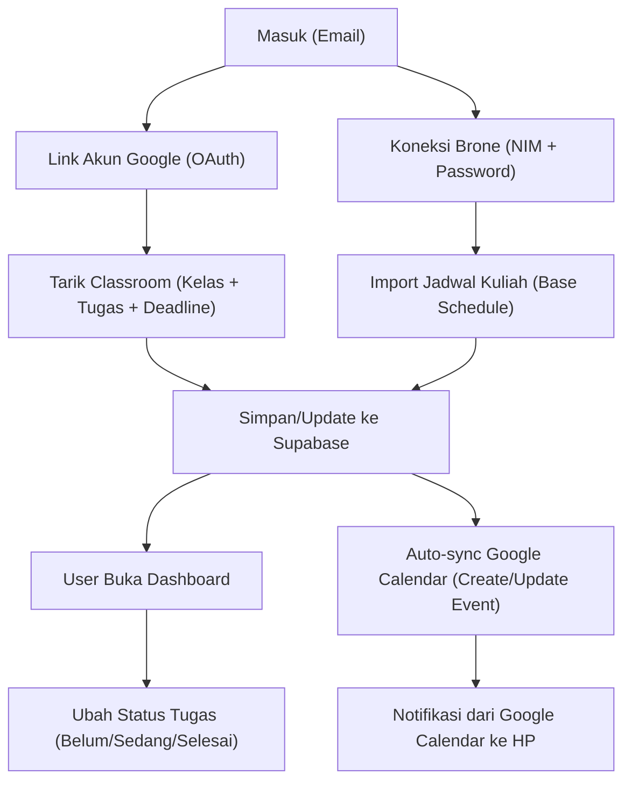

## 1. Ikhtisar Produk
PenjadwalanAnca adalah aplikasi mobile-first untuk memantau jadwal kuliah dan deadline tugas (Manual + Google Classroom + Brone), lengkap dengan status pengerjaan dan sinkronisasi otomatis ke Google Calendar.
Target user utamanya mahasiswa UB yang butuh satu tempat terpusat untuk “hari ini harus ngapain”.

## 2. Fitur Inti

### 2.1 Peran Pengguna
| Peran | Cara Masuk | Hak Akses Inti |
|------|------------|----------------|
| Pengguna | Email + koneksi Google (opsional tapi direkomendasikan) | Kelola tugas & jadwal, sync Classroom/Brone, auto-sync Google Calendar |

### 2.2 Modul Fitur (Minimum Viable Product)
1. **Masuk & Koneksi Akun**: email login, link akun Google UB, koneksi Brone
2. **Dashboard (Home)**: ringkasan hari ini, upcoming, weekly view scroll, badge tugas belum selesai
3. **Tugas**: list + filter/sort, detail, ubah status (Belum/Sedang/Selesai), tambah manual
4. **Jadwal**: weekly schedule dari Brone sebagai base schedule + tampilan mobile-friendly
5. **Mata Kuliah**: list course + progress tracker (selesai/total)
6. **Pengaturan**: preferensi reminder, toggle auto-sync per sumber, tema (dark/light), koneksi akun

### 2.3 Detail Halaman
| Halaman | Modul | Deskripsi Fitur |
|--------|-------|------------------|
| /login | Email login | Masuk dengan email, redirect ke dashboard |
| /login | Link Google UB | Connect Google untuk Classroom + Calendar (OAuth) |
| /dashboard | Hari ini | Mata kuliah hari ini + tugas deadline hari ini/besok |
| /dashboard | Weekly view | Kalender minggu sederhana yang bisa di-scroll |
| /dashboard | Badge | Badge jumlah tugas belum selesai + indikator overdue |
| /tasks | Filter & sort | Hari, mata kuliah, status, sumber, prioritas |
| /tasks | CRUD manual | Tambah/edit/hapus tugas manual (judul, course, deadline, deskripsi, prioritas) |
| /tasks/[id] | Detail | Deskripsi, link eksternal (Classroom/Brone), status submission (Classroom) |
| /schedule | Weekly schedule | Tampilan jadwal mingguan dari Brone, fokus “hari ini” |
| /courses | Progress | Progress per mata kuliah (selesai/total) + breakdown status |
| /settings | Preferensi | Default reminder, toggle auto-sync GCal per sumber, tema |
| /settings | Brone | Input NIM + password, status koneksi, tombol refresh/import |

## 3. Proses Inti
Alur utama yang harus mulus:
1. User daftar/masuk via email.
2. User menghubungkan akun Google UB untuk menarik data Classroom dan mengizinkan akses Calendar.
3. User memasukkan kredensial Brone sekali untuk import jadwal dasar.
4. Sistem melakukan sinkronisasi berkala (Classroom + Brone), menyimpan hasil ke database.
5. Di aplikasi, user melihat ringkasan “hari ini” dan mengubah status tugas sampai selesai.
6. Semua tugas baru otomatis dibuat/di-update sebagai event di Google Calendar (idempotent).

## 4. Desain Antarmuka

### 4.1 Gaya Desain
- Arah visual: “agenda editorial” yang bersih, fokus keterbacaan, tapi tetap punya karakter
- Tipografi: heading font bergaya editorial + body font yang sangat readable (mobile-first, ukuran besar)
- Warna: palet netral (kertas/ink) dengan aksen tajam untuk prioritas & overdue
- Komponen: card ringan, divider halus, chip filter besar, tombol tap-friendly
- Navigasi: bottom navigation bar dengan 4–5 tab utama

### 4.2 Ringkasan UI per Halaman
| Halaman | Modul | Elemen UI |
|--------|-------|-----------|
| /dashboard | Hari ini | List ringkas + badge, CTA cepat “Tambah tugas” |
| /dashboard | Weekly view | Strip minggu yang dapat di-scroll horizontal + highlight hari ini |
| /tasks | Filter bar | Chip filter besar, sticky bar, sort dropdown |
| /tasks/[id] | Detail | Card info, status toggle, prioritas, link eksternal |
| /schedule | Jadwal | Grid/stack per hari, “sekarang” indicator, swipe antar hari |
| /settings | Preferensi | Toggle, selector reminder, status koneksi akun |

### 4.3 Responsiveness
- Mobile-first sebagai default (tap target besar, bottom nav)
- Tablet/desktop: layout dua kolom (list + detail) bila memungkinkan
- Aksesibilitas dasar: kontras memadai, fokus keyboard untuk desktop

